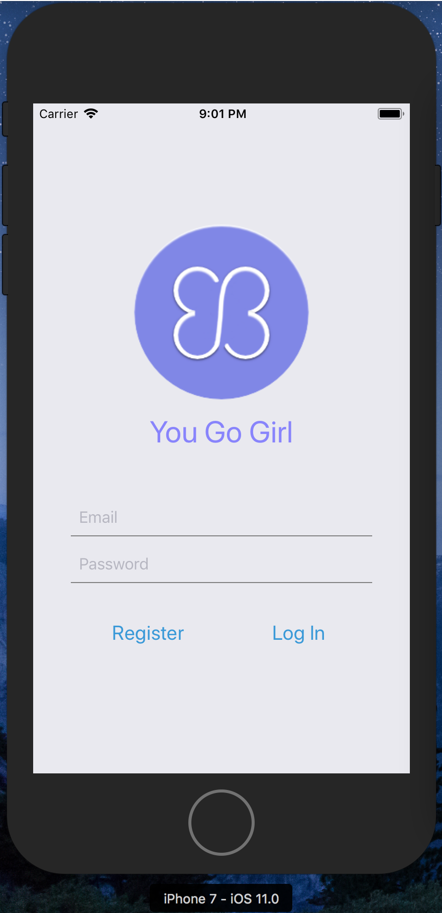
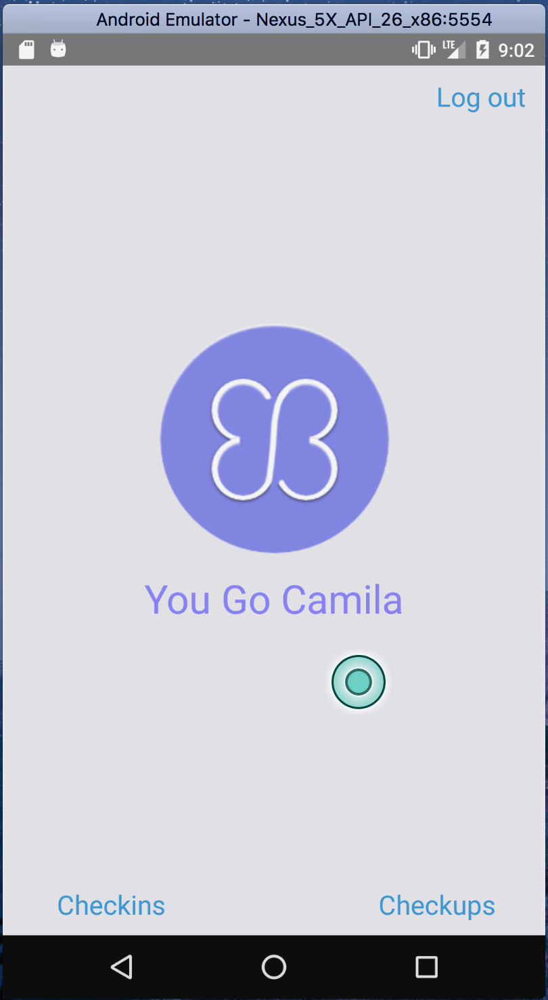
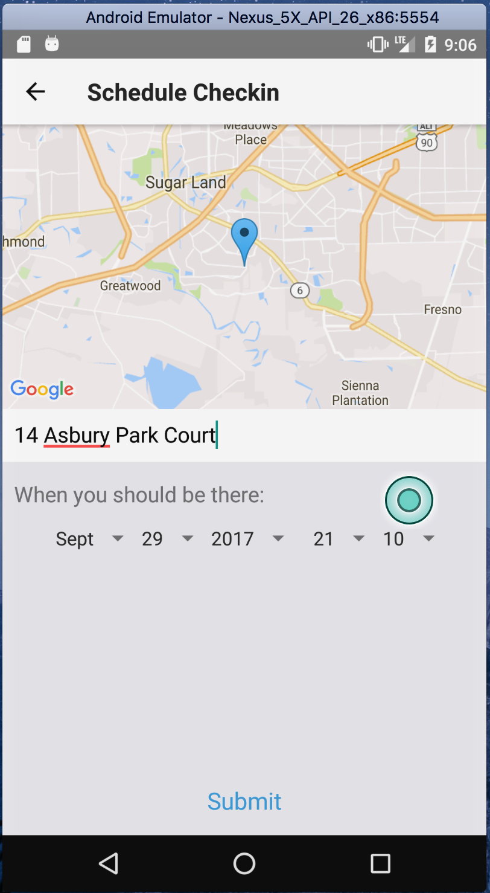
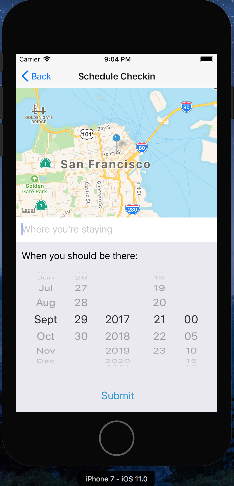
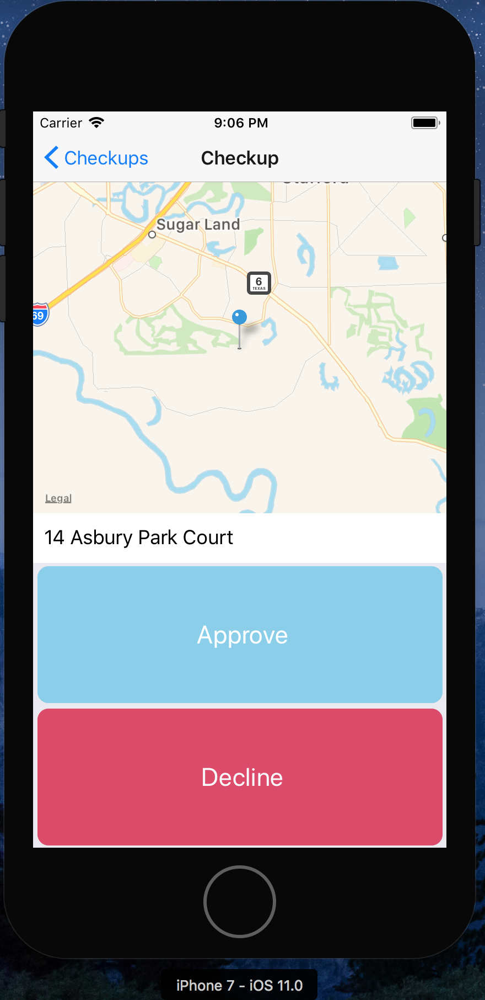
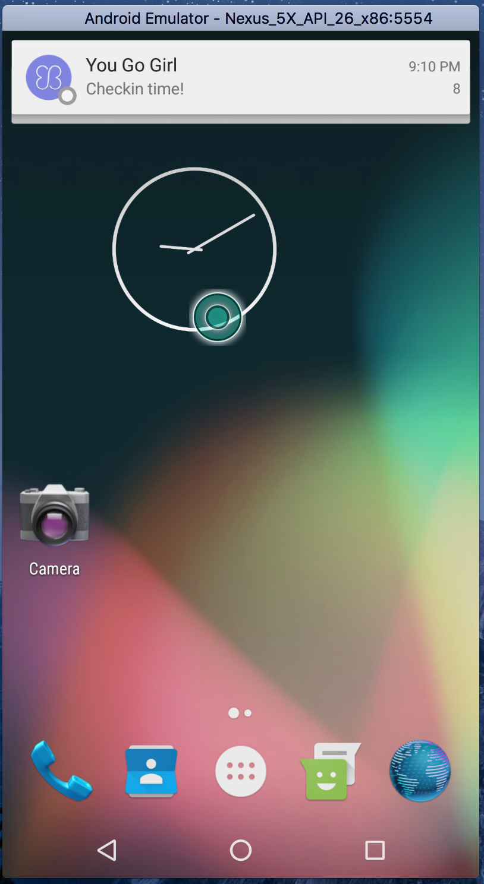
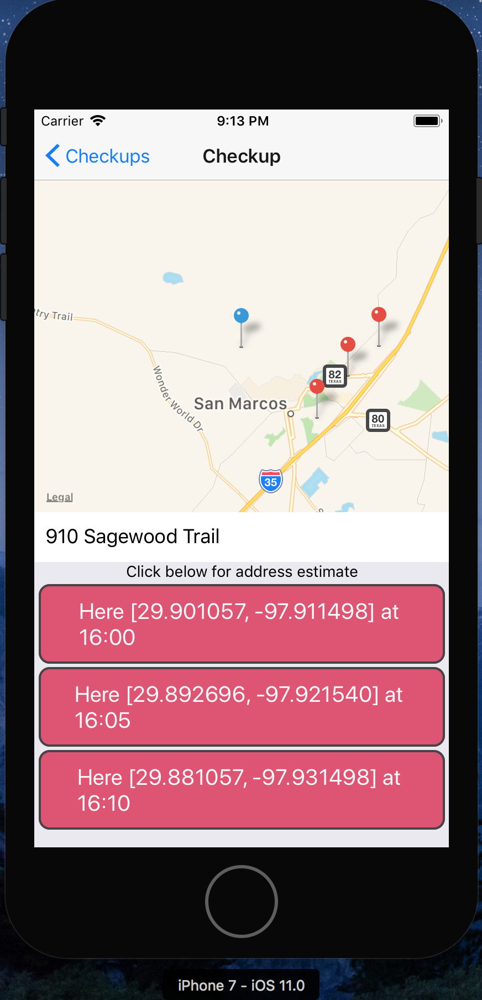
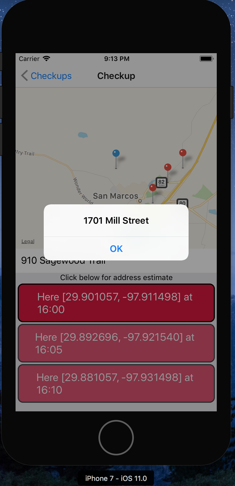

Project Backlog: https://trello.com/b/1rosETC9/you-go-girl

ABOUT: You Go Girl offers users, who want to feel safer when they go out, an alternative to 24/7 location tracking and user-interaction-dependent features. It’s designed to respect user privacy, and to be useful regardless of user-interaction.

TECH: React-Native Node.js, Postgres, and Sequelize.

TECHNICAL FEATS
•	Used React-Native to develop Cross-Platform Mobile Application[Android & iOS]
•	Solved Platform-Specific problems where React-Native came up short
•	Integrated Notifications
•	Integrated Geolocation
•	Implemented Authentication that Persists User Session Locally
•	Integrated Google & Apple Maps API
•	Deployed JSON API in Node.js to Heroku
•	Used complex toolkit for simulation and feature testing.
•	Modeled data, managed migrations, and seeded database
•	Used Git for Version Control
•	Solved a Real Human Problem with Software

UPDATES
JSON API live on Heroku.
Postgres database pushed to Heroku.

react-native run-ios or run in xCode.
react-native run-android or run in Android Studio.

Mock location on simulator/emulator:
lat: "29.742063",
lng: "-95.386246"

